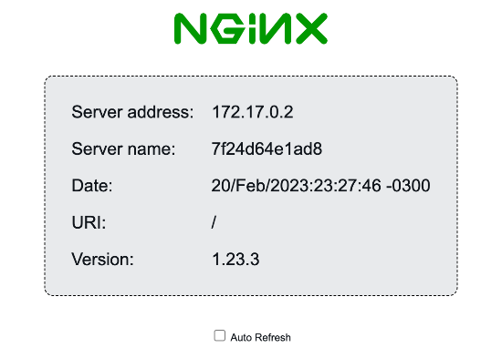

# NGINX Dockerfiles

A bunch of Dockerfiles for [NGINX](https://www.nginx.com/products/nginx/).

Let’s look into this [repo’s](https://gitlab.com/afreisinger/nginx) .gilab-ci.yml as well as [docker hub](https://hub.docker.com/repository/docker/afreisinger/nginx/general)


 

## Build and run NGINX Docker containers (Using Script)

Run `./build-nginx.sh [build_name]`, where `[build_name]` one of:

| `[build_name]`            | Description                                      |
| ------------------------- |--------------------------------------------------| 
|`alpine3.10`               | Alpine Linux 3.10 with NGINX                     |
|`alpine3.16.3`             | Alpine Linux 3.16.3 with NGINX                   |
|`alpine3.17.1`             | Alpine Linux 3.17.1 with NGINX                   |
|`alpine3.17.2`             | Alpine Linux 3.17.2 with NGINX 1.23.3            |
|`ubuntu18.04`              | Ubuntu 18.04 with NGINX                          |
|`centos8`                  | CentOS 8 with NGINX                              |
|`hello`                    | NGINX webserver that serves a simple html page        |                     
|`hello-plaintext`            | NGINX webserver that serves a plain text page          |  
|`nginx1.21.1`  | NGINX 1.21.1 as an HTTP and HTTPS (SSL terminating) + upstream check module|  
|`stable`  |  NGINX 1.22.1 and Alpine Linux 3.17|  

## Build NGINX Docker container using script

 1. Prepare your NGINX  files in the correct build directories, ssl is not mandatory, you can modify your Dockerfile
      
      * [How To Create a Self-Signed SSL Certificate for Nginx](https://www.digitalocean.com/community/tutorials/how-to-create-a-self-signed-ssl-certificate-for-nginx-on-debian-10)
      
      * **For NGINX:** Copy your `nginx-selfsigned.crt` and `nginx-selfsigned.key` into [`certs/`](./nginx/certs) directory
      
 2. Build an image from your Dockerfile:
    ```bash
    # ./build-nginx.sh [Build-name]
    $ ./build-nginx.sh alpine3.10
    ```

 3. See the Docker images available
    ```bash
    # NGINX images are named nginx
    $ docker images | grep nginx
    ```
## Build NGINX Docker container Manually

 1. Prepare your NGINX  files in the correct build directories, ssl is not mandatory, you can modify your Dockerfile
      
      * [How To Create a Self-Signed SSL Certificate for Nginx](https://www.digitalocean.com/community/tutorials/how-to-create-a-self-signed-ssl-certificate-for-nginx-on-debian-10)
      
      * **For NGINX:** Copy your `nginx-selfsigned.crt` and `nginx-selfsigned.key` into [`certs/`](./nginx/certs) directory
     
 2. Copy the desired [`Dockerfile`](./Dockerfiles) into the correct build folder:
      * [`nginx`](./nginx) - NGINX only
     
 2. Build an image from your Dockerfile:
    ```bash
    # Run command from the folder containing the `Dockerfile`
    # docker build -t [docker_image_name] .
    $ docker build -t alpine3.10 .
    ```

## Run the Container

 1. Start the container, e.g.:
    ```bash
    # e.g. NGINX 
    # Start a new container and publish container ports 80, 443 and 90, 91, 92 to the host not mandatory.
    # Where [docker_image_name] is found on the last step
    $ docker run -d -p 80:80 -p 443:443 -p 90:90 -p 91:91 -p 92:92 [docker_image_name]
    ```

 2. **Optional**: Mount local volume:

    ```bash
    docker run -d \
      -p 80:80 -p 443:443 \
     
      -v $PWD/etc/nginx:/etc/nginx [docker_image_name]
    ```
## Useful Docker commands


 1. To run commands in the docker container you first need to start a bash session inside the nginx container
    ```bash
    # get Docker IDs of running containers
    docker ps
    # Enter a Alpine Linux BusyBox shell
    sudo docker exec -i -t [CONTAINER ID] /bin/sh
    # OR
    # Enter a Linux Bash shell
    sudo docker exec -i -t [CONTAINER ID] /bin/bash
    ```

 2. To open logs
    ```bash
    # get Docker IDs of running containers
    docker ps
    # View and follow container logs
    sudo docker logs -f [CONTAINER ID]
    ```


## Compile Nginx

When configuring the Nginx makefile, you'll choose many command-line options, which are described below.

## Mandatory Options  

**These options are required.**  

--prefix= the directory for Nginx configuration files.  

--sbin-path= the path for the Nginx binary.  

--pid-path= the path for the Nginx pidfile.  

--lock-path= the path for the Nginx lockfile.  

--conf-path= the path for the Nginx configuration file.  

--modules-path= the path for Nginx modules.  

--error-log-path= the path for the error log file.  

--http-log-path= the path for the access log file.  

--user= the user name for worker processes.  

--group= the group name for worker processes.  

--with-pcre= the path for the PCRE source code library.  

--with-pcre-jit= PCRE will be used in just-in-time compilation mode.  

--with-zlib= the path for the zlib source code library.  

--with-openssl= the path ofor the openssl source code library.  


## Optional Settings  

**Speed and Security**  

--with-http-ssl module enable HTTPS.  

--with-httpv2 module enable HTTP/2.  

--with-threads enables Thread Pools for better performance.  

--with-file-aio enables asynchronous I/O for better performance.  

--with-http-degradation module return an error if the request uses too much memory.  

--with-http-auth-request module allows basic HTTP authentication.  

--with-http-geoip module enables Goelocation from the user’s IP address.  

--with-http-realip module sets the real client IP instead of the one specified in the header.  

--with-http-securelink module protect resources from unauthorized access.  

**Metrics and Advanced**    

--with-cpp-test module checks C++ compatibility.  

--with-debug enables the debug log debug.  

--with-google-perftools module enables the Google Performance Toolkit.  

--with-http-stubstatus module enables basic status information.  


**Additional Functions**  

--with-mail enables the mail proxy.  

--with-mailssl module allows email proxying through SSL/TLS.  

--with-http-mp4 module adds support for MP4 file streaming.  

--with-http-flv module adds support for FLV file streaming.  

--with-stream enables streaming through a proxy with UDP/TCP protocols.  

--with-stream-ssl module enables Nginx to proxy streams through SSL/TLS.  

--with-stream-ssl-preread module extract information from "ClientHello" without closing SSL/TLS.  

--with-http-dav module enables WebDAV file management.  

--with-http-imagefilter module allows image transformation in PNG, JPEG and GIF format.  

--with-http-gunzip module decompress requests with gzip if the client does not support the zip encoding.  

--with-http-gzipstatic module send pre-compressed .gz files instead of regular files.  

--with-http-perl module implements PERL.  

--with-http-addition module insert text before and after an answer.  

--with-http-randomindex module show a random page when a file in the URL can not be defined.  

--with-https-licemodule divide a request into subrequests, useful for caching of large files.  

--with-http-submodule change text in replies.  

--with-http-xslt module transform XML with XSLT.  

--with-selec module enables the select() method.  

--with-poll module enables the poll() method.  